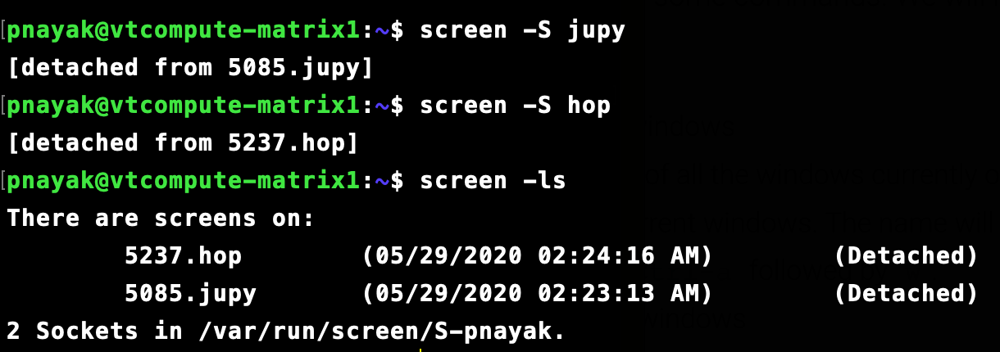

## SCREEN tool - Usage & Tips

SCREEN application in a terminal is the most useful when using resources over a ssh-session, or for prolonged exerimental runs where you do not want the network issues to crash the session runs remotely. 

Here, we shall see some basic commands to play with screen and how its useful.

#### Invoke a new SCREEN

Starting a new screen with a name

```bash
screen -S <name>
```

When you create a new screen, we can have multiple windows within a single screen and cycle between them. 

#### Detach from a SCREEN

Once we are in a screen, we can detach from the screen while keeping things in the screen running.

The command for this is pressing `CTRL + a` (then realease) and then press `d` 

#### List all the screen processes

Once you have multiple screens running, we can list the screen processes running

```bash
screen -ls
```



#### Re-Attach to a deatched SCREEN

Once you have listed the screen processes and want to re-attach to a particular screen can be done in two ways

```bash
screen -r <screen_name>
``` 

```bash
screen -r <screen_PID>
```

#### Some Basic Commands within SCREEN

Creating a new window within a screen -> `CTRL + a` (then release) followed by `c` 

List the number of windows in a screen -> `CTRL + a` (then release) followed by `w`

Switch between windows in a screen -> Next Window `CTRL + a` followed by `n` (next window) and `p` (previous window)
The top and bottom of the terminal window shows the window you are on. 

You can also switch to a particular window within a screen -> `CTRL + a` followed by number (window number)

#### Scrolling & Logging in SCREEN terminal

SCREEN terminal is not similar to a normal terminal in terms of scrolling. Since its a application within a terminal, it has a different buffer for the terminal display storage. 

To switch to the scrolling buffer within a screen -> `CTRL + a` (release) followed by `ESC`

Now, we can scroll through the screen terminal display, and use the same command to exit the buffer back to terminal

We can also log the entire SCREEN process terminal display to a file. This can be done by the flag `-L` while creating the screen as follows

```bash
screen -L -S <screen_name>
```
This will create a file `screenlog.0` file in the home directory of the bash-session

#### Lock the SCREEN 

You can also lock the screen (similar to locking the desktop in a computer). The password is the same password you would use for the login into the machine. 

While being attached in the screen -> `CTRL + a` (release) followed by `x` 

It will prompt of the login password to reattach. 

#### Kill a SCREEN

Finally, once you have the screen process finished with the intended runs, we can kill the screen in two ways. 

While being attached and in a particular screen  -> `CTRL + a` followed by `k` (kill)

Also, we can kill a screen after detaching by first checking the pid or name using screen process listing and then using the command

```bash
screen -X -S <screen_name/PID> quit
```


