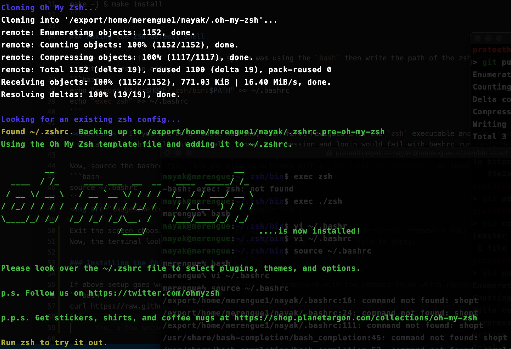
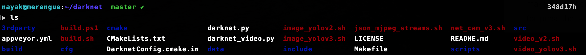

# ZSH Shell [with OH-MY-ZSH config]

### Installation [without root]

Obtain the `sourceforge` tar file of the `zsh` shell files

```bash
wget -O zsh.tar.xz https://sourceforge.net/projects/zsh/files/latest/download
```
Create a new dir to store the installation files. 

```bash
mkdir .zsh
```

untar the files, you get a local dir named `zsh-5.7.1`

```bash
tar -xf zsh.tar.xz 
```

Now, we need to configure the installation to the created dir. Here, the dir `.zsh` created in `$HOME`. You can check the home env using `echo $HOME`

```bash
cd zsh-5.7.1
./configure --prefix=$HOME/.zsh/
```

Once, the configuration is finished without any errors, we can install the zsh-shell using the following commands
```bash
make -j & make install
```

### Making the ZSH default shell

Before installation of `zsh`, if the system was using the `bash` then write the path of the zsh-shell installed into the system path & and execute the zsh on entry
```bash 
echo "export PATH=$HOME/.zsh/bin:$PATH" >> ~/.bashrc
echo "exec zsh" >> ~/.bashrc
```

**CAUTION** : If you are on a remote machine, then first navigate into the `zsh` executable and run it once before adding the path to bashrc, as a mistake in bashrc will automatically logout your session and login would fail with bashrc run fail thereafter.

Now, source the bashrc file, and you will be welcomed with a `zsh-firsttime-installer` as shown below
```bash 
source ~/.bashrc
```


Exit the screen choosing option `(0)`, as we will be installing the `oh-my-zsh` framework over the base `zsh` shell.
Now, the terminal look is changed to bare minimum as the `~/.zshrc` file is empty.

### Installing the OH-MY-ZSH framework

If above setup goes well, install the `oh-my-zsh` framework with the command below which replaces the `~/.zshrc` with a new file (same name)
```bash
curl https://raw.githubusercontent.com/robbyrussell/oh-my-zsh/master/tools/install.sh | sed -e 's/grep\ \/zsh\$\ \/etc\/shells/which zsh/g' | zsh
```
The installation is quick and we are welcomed with the `oh-my-zsh` installation. As specified, enter command `zsh` to enter the `oh-my-zsh` shell.



### Configuring & Features of OH-MY-ZSH

**Note** : Every time we add something to the `~/.zshrc`, we need to source it using the command `source ~/.zshrc` for the changes to be seen. 

#### Change the Themes

The first thing is we can change the themes for our terminal. There are tons of stock theme options we can choose from. For the best view before changing, you can use this [Reference](https://github.com/ohmyzsh/ohmyzsh/wiki/Themes). By Default, on installation the theme is `robbyrussell`

Open the `zshrc` file using a `vim` or your fav editor. Look for the env variable `ZSH_THEME`, change the theme name to the one needed. My personal fav is the theme named `avit`. Shown below



One amazing feature of `ZSH` is that contrary to bash, it's a right & left prompt. You can use the prompt theme `agnoster` and you will know why !

#### Installing some nice plugins

`zsh-plugins` are a way to add features to the zsh-terminal. These include tool plugins like `git`,`nc`,etc. or also some of the basic operations like `cd`,`ls`,etc. come with extra ease of use or functionality.

All plugins are installed in the folder **$HOME/.oh-my-zsh/custom/plugins**

Lets go ahead, and install one of the cool plugins which make the terminal use more easy ! 
The plugin is called `auto-suggestions`. As the name suggests, it helps in suggesting commands while typing. 
Following command, installs the plugin directly into the custom/plugin folder. 
```bash
git clone https://github.com/zsh-users/zsh-autosuggestions ${ZSH_CUSTOM:-~/.oh-my-zsh/custom}/plugins/zsh-autosuggestions
```

Now, we need to specify the plugin in the `~/.zshrc` config file of the shell. Navigate to the `.zshrc` file and look for the env variable name `plugins`

Set `plugins =(git zsh-autosuggestions)`

Source the `~/.zshrc` and now you can see suggestions for commands as below (the suggestions get better with history). You can choose the suggestions by pressing the right-arrow key while typing to finish the command. 


You can lookout for more such cool Plugins at this Reference - [Plugins](https://github.com/ohmyzsh/ohmyzsh/wiki/plugins). One of my fav is the plugin named `z` which helps in a more intelligent suggestion on commands through fuzzy-logic !

#### Some basic functionality to Enhace productivity on Terminal....

There are some minute things we do on the terminal which are straightforward but can be done easier and in a more cooler way ! 

##### Changing Dirs 

Navigating between directories, going up and down dirs is made easy in ZSH with just using dots and including slashes ! 


The other cool thing is `cd` is no more Case-Sensitive, and finally, we can just mention the first letter of the folders separated by slashes and hit TAB to see the path magically filled ! And, it doesnt stop here; We can navigate without using `cd` ! and just entering the paths. 


##### Open files anywher in the directory and Listing Files with Filters 

If we need to open a file somewhere down the directory, and we know the file name, all we need to do is know the path. But in ZSH ! no, you directly specify file name and terminal figures out the path

Also, listing files based on size, or list the files edited the last (say 1-4 lines edited) in the directory is sometimes useful.


