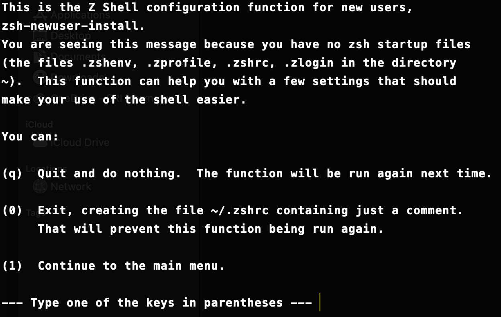

# ZSH Shell [with OH-MY-ZSH config]

### Installation [without root]

Obtain the `sourceforge` tar file of the `zsh` shell files

```bash
wget -O zsh.tar.xz https://sourceforge.net/projects/zsh/files/latest/download
```
Create a new dir to store the installation files. 

```bash
mkdir .zsh
```

untar the files, you get a local dir named `zsh-5.7.1`

```bash
tar -xf zsh.tar.xz 
```

Now, we need to configure the installation to the created dir. Here, the dir `.zsh` created in `$HOME`. You can check the home env using `echo $HOME`

```bash
cd zsh-5.7.1
./configure --prefix=$HOME/.zsh/
```

Once, the configuration is finished without any errors, we can install the zsh-shell using the following commands
```bash
make -j & make install
```

### Making the ZSH default shell

Before installation of `zsh`, if the system was using the `bash` then write the path of the zsh-shell installed into the system path & and execute the zsh on entry
```bash 
echo "export PATH=$HOME/.zsh/bin:$PATH" >> ~/.bashrc
echo "exec zsh" >> ~/.bashrc
```

**CAUTION** : If you are on a remote machine, then first navigate into the `zsh` executable and run it once before adding the path to bashrc, as a mistake in bashrc will automatically logout your session and login would fail with bashrc run fail thereafter.

Now, source the bashrc file, and you will be welcomed with a `zsh-firsttime-installer` as shown below
```bash 
source ~/.bashrc
```


Exit the screen choosing option `(0)`, as we will be installing the `oh-my-zsh` framework over the base `zsh` shell.
Now, the terminal look is changed to bare minimum as the `~/.zshrc` file is empty.

### Installing the OH-MY-ZSH framework

If above setup goes well, install the `oh-my-zsh` framework with the command below which replaces the `~/.zshrc` with a new file (same name)
```bash
curl https://raw.githubusercontent.com/robbyrussell/oh-my-zsh/master/tools/install.sh | sed -e 's/grep\ \/zsh\$\ \/etc\/shells/which zsh/g' | zsh
```
The installation is quick and we are welcomed with the `oh-my-zsh` installation. As specified, enter command `zsh` to enter the `oh-my-zsh` shell.


### Configuring & Features of OH-MY-ZSH


#### To change the Themes

The first thing is we can change the themes for our terminal. There are tons of stock theme options we can choose from. For the best view before changing, you can use this [Reference](https://github.com/ohmyzsh/ohmyzsh/wiki/Themes). By Default, on installation the theme is `robbyrussell`

Open the `zshrc` file using a `vim` or your fav editor. Look for the env variable `ZSH_THEME`, change the theme name to the one needed. My personal fav is the theme named `avit`. Shown below


One amazing feature of `ZSH` is that contrary to bash, it's a right & left prompt. You can use the prompt theme `agnoster` and you will know why !

#### Installing some nice plugins

`zsh-plugins` are a way to add features to the zsh-terminal. These include tool plugins like `git`,`nc`,etc. or also some of the basic operations like `cd`,`ls`,etc. come with extra ease of use or functionality.

All plugins are installed in the folder **$HOME/.oh-my-zsh/custom/plugins**
